# IRT and CFA

This analysis was written in Quarto, and the source file can be found at

https://github.com/alexm123/CFAvsIRT

Below, I will analyze the same dataset using both Item Response Theory
(IRT) and Confirmatory Factor Analysis (CFA) to compare and contrast
between the two.

## The Data

The 2015-2016 NHANES Mental Health - Depression Screener.

Originally a rating scale (0, Not at all; 1, several days; 2, more than
half the days; 3, nearly everyday)

Q1: “Have little interest in doing things”

Q2: “Feeling down, depressed, or hopeless”

Q3: “Trouble sleeping or sleeping too much”

Q4: “Feeling tired or having little energy”

Q5: “Poor appetite or overeating”

Q6: “Feeling bad about yourself”

Q7: “Trouble concentrating on things”

Q8: “Moving or speaking slowly or too fast”

Q9: “Thought you would be better off dead”

Q10: “Difficulty these problems have caused”

Looking at the questions, we clearly see that Q10 does not fit in with
the rest. It violates the assumption of local independence (A
participant’s answer to Q10 depends on their answers to the other
questions). To that end, I had Q10 dropped from the data set.

## Import Dataset

For the initial analysis, I opted to dichotomize the data by having any
value above 0 changed to a 1.

``` r
# Mental Health - Depression Screener from
# https://wwwn.cdc.gov/nchs/nhanes/search/datapage.aspx?Component=Questionnaire&CycleBeginYear=2015

ds <- haven::read_xpt("https://wwwn.cdc.gov/Nchs/Nhanes/2015-2016/DPQ_I.XPT")
ds <- ds[- 11]


names(ds) <- c("id", paste0("q", 1:9))

ds$id <- NULL

ds <- ds %>%
  mutate_at(vars(q1:q9), ~ifelse(. > 3, NA, .))

ds_dich <- ds %>%
  mutate_at(vars(q1:q9), ~ifelse(. > 0, 1, 0))

qmeans <- apply(ds_dich, 2, mean, na.rm = TRUE)

barplot(qmeans)
```

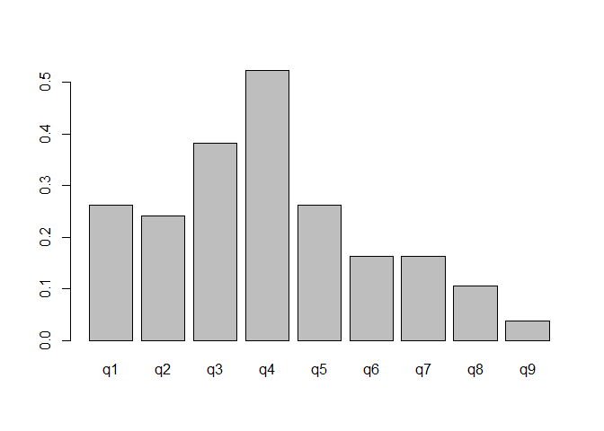

This graph shows the mean number of endorsements an answer received.
Here, we can see that q4 (“Feeling tired or having little energy”) had
the most positive answers, while q9 (“Thought you would be better off
dead”) had very few endorsements.

Before attempting to fit an IRT model, it would be good to examine
whether the 9 items are all measuring the same latent variable. In our
case, depression. This is done with a *scree test*, the components left
of the “elbow” (the sharpest drop) of the graph should be retained. As
we want to measure just 1 latent variable, we want there to be just 1
component before the elbow.

``` r
screep <- fa.parallel(ds_dich, cor = "tet")
```

``` r
x <- 1:length(screep$fa.values)
plot(x, screep$fa.values, type = "b", pch = 16, col = "blue", 
     xlab = "Factor Number", 
     ylab = "eigenvalues of factor analysis", 
     main = "Scree Plot")
```

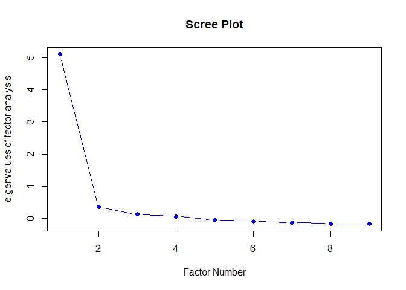

As shown, the scree plot suggests there is only 1 underlying factor. We
can now proceed to fit the IRT models.

## Fit 1PL Model

Here, I fitted a 1PL (1-parameter logistic) model to estimate item
difficulty based on how many people answered the items.

``` r
pl1 <- ltm::rasch(ds_dich)
kable(summary(pl1)$coefficients, digits = 2)
```

|           | value | std.err | z.vals |
|:----------|------:|--------:|-------:|
| Dffclt.q1 |  0.84 |    0.03 |  32.27 |
| Dffclt.q2 |  0.93 |    0.03 |  34.64 |
| Dffclt.q3 |  0.40 |    0.02 |  16.86 |
| Dffclt.q4 | -0.07 |    0.02 |  -3.17 |
| Dffclt.q5 |  0.84 |    0.03 |  32.27 |
| Dffclt.q6 |  1.30 |    0.03 |  42.11 |
| Dffclt.q7 |  1.30 |    0.03 |  42.17 |
| Dffclt.q8 |  1.66 |    0.04 |  45.85 |
| Dffclt.q9 |  2.40 |    0.05 |  45.52 |
| Dscrmn    |  2.01 |    0.03 |  57.66 |

Q1 has a difficulty score of 0.84. This refers to the fact that an
individual with the “depression level” of 0.84 would have a 0.5
probability of endorsing Q1. Every item was fixed to have the same
discrimination, which will be explained further on.

## Fit 2PL Model

Next, I fitted a 2PL model to estimate each item’s discrimination
parameter. I will later graph this information, to better show what it
means.

``` r
pl2 <- ltm(ds_dich ~ z1)

kable(summary(pl2)$coefficients, digits = 2)
```

|           | value | std.err | z.vals |
|:----------|------:|--------:|-------:|
| Dffclt.q1 |  0.84 |    0.03 |  29.56 |
| Dffclt.q2 |  0.81 |    0.02 |  34.27 |
| Dffclt.q3 |  0.45 |    0.03 |  16.19 |
| Dffclt.q4 | -0.07 |    0.02 |  -2.93 |
| Dffclt.q5 |  0.95 |    0.04 |  27.10 |
| Dffclt.q6 |  1.17 |    0.03 |  39.27 |
| Dffclt.q7 |  1.34 |    0.04 |  33.81 |
| Dffclt.q8 |  1.69 |    0.05 |  33.75 |
| Dffclt.q9 |  2.20 |    0.07 |  31.25 |
| Dscrmn.q1 |  2.07 |    0.08 |  24.34 |
| Dscrmn.q2 |  3.18 |    0.16 |  20.19 |
| Dscrmn.q3 |  1.57 |    0.06 |  24.89 |
| Dscrmn.q4 |  1.91 |    0.08 |  23.99 |
| Dscrmn.q5 |  1.56 |    0.06 |  24.08 |
| Dscrmn.q6 |  2.75 |    0.13 |  21.24 |
| Dscrmn.q7 |  1.89 |    0.08 |  22.55 |
| Dscrmn.q8 |  1.94 |    0.10 |  20.29 |
| Dscrmn.q9 |  2.48 |    0.17 |  14.31 |

Here, I test to see if 2PL model has a significantly better fit than 1PL
model, by evaluating their model characteristics within an ANOVA. 2PL
model has many more parameters, as seen by each question’s
discrimination parameter. The ANOVA will compare the AIC’s of the two
models, to see if the more complex model fits the data better.

``` r
anova(pl1, pl2)
```


     Likelihood Ratio Table
             AIC      BIC   log.Lik    LRT df p.value
    pl1 38038.94 38105.49 -19009.47                  
    pl2 37849.45 37969.23 -18906.72 205.49  8  <0.001

The significant p-value in this chart tells us that the 2PL is a better
fit to the data the 1PL. The fit of the model has been improved by
estimating the discrimination parameter of each item, instead of fixing
it to one value. If both models had fit the data similarly well, then
the parsimony principle tells us that the simpler model should have been
favored.

## Item Characteristic Curves

Below, I plotted the item characteristic curves of the 10 items to
better see the discriminability across items.

``` r
plot(pl2, type = c("ICC"))
```

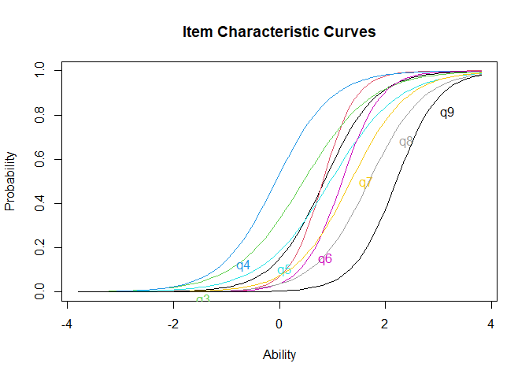

In the ICCs, we can better see the probability of endorsing an answer at
varying ability levels. We see that q4 (the blue curve on the left;
“Feeling tired or having little energy”) has a range of abilities
endorsing it, while with q9 (the black curve on the right; “Thought you
would be better off dead”), only individuals with the highest level of
depression endorsed it. So, discrimination can be seen as the steepness
of these curves.

## Item Information Curves

``` r
plot(pl2, type = c("IIC"))
```

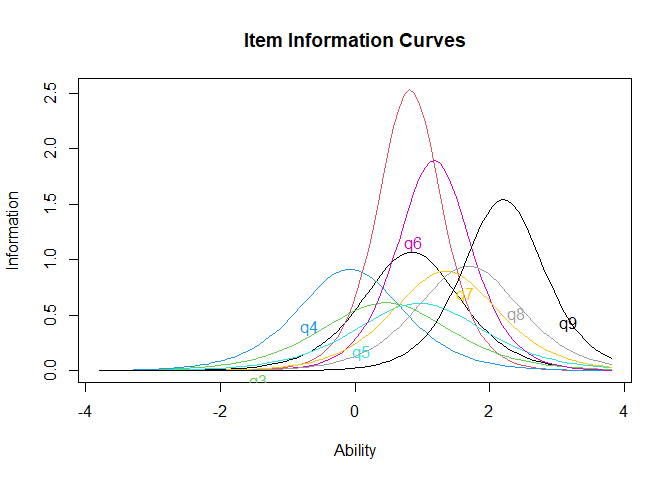

The IICs demonstrate that items range in how much information they
provide about an individuals depression level for different ability
levels. Item q10 (the red curve) gives us a the most information at
moderate depression levels. In contrast, item q4 (the blue curve), gives
us very low information because of how wide a range of depression levels
it covers.

## Sum of all IIC Curves

``` r
plot(pl2, type = c("IIC"), items = c(0))
```

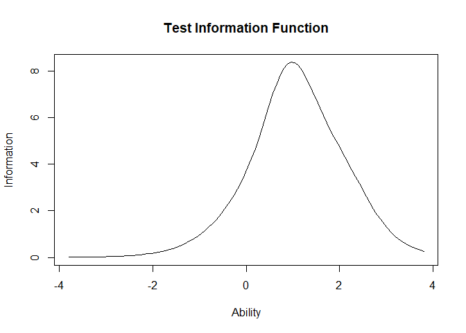

The test information function shows that the items as a whole provide
the most information about low-to-moderate depression levels, and less
about extreme high or low depression levels. This is desirable, as it is
not important to discriminate between those with very low or very high
depression. It is important to discriminate between those of moderate
depression levels, which is what the test information function tells us
it does.

## Confirmatory Factor Analysis with Dichotomous Data

``` r
mod <-
  "depression =~ q1 + q2 + q3 + q4 + q5 +
                 q6 + q7 + q8 + q9
   
"


cfafit <- cfa(mod, data = ds_dich,
              ordered = c("q1", "q2", "q3", "q4", "q5",
                          "q6", "q7", "q8", "q9"),
              estimator = "WLSMV",
              check.gradient = TRUE
              )

summary(cfafit, fit.measures = TRUE, standardized = TRUE)
```

    lavaan 0.6.15 ended normally after 17 iterations

      Estimator                                       DWLS
      Optimization method                           NLMINB
      Number of model parameters                        18

                                                      Used       Total
      Number of observations                          5134        5735

    Model Test User Model:
                                                  Standard      Scaled
      Test Statistic                               269.518     404.621
      Degrees of freedom                                27          27
      P-value (Chi-square)                           0.000       0.000
      Scaling correction factor                                  0.669
      Shift parameter                                            1.484
        simple second-order correction                                

    Model Test Baseline Model:

      Test statistic                             28028.387   19894.317
      Degrees of freedom                                36          36
      P-value                                        0.000       0.000
      Scaling correction factor                                  1.410

    User Model versus Baseline Model:

      Comparative Fit Index (CFI)                    0.991       0.981
      Tucker-Lewis Index (TLI)                       0.988       0.975
                                                                      
      Robust Comparative Fit Index (CFI)                         0.901
      Robust Tucker-Lewis Index (TLI)                            0.868

    Root Mean Square Error of Approximation:

      RMSEA                                          0.042       0.052
      90 Percent confidence interval - lower         0.037       0.048
      90 Percent confidence interval - upper         0.046       0.057
      P-value H_0: RMSEA <= 0.050                    0.998       0.203
      P-value H_0: RMSEA >= 0.080                    0.000       0.000
                                                                      
      Robust RMSEA                                               0.146
      90 Percent confidence interval - lower                     0.131
      90 Percent confidence interval - upper                     0.161
      P-value H_0: Robust RMSEA <= 0.050                         0.000
      P-value H_0: Robust RMSEA >= 0.080                         1.000

    Standardized Root Mean Square Residual:

      SRMR                                           0.053       0.053

    Parameter Estimates:

      Standard errors                           Robust.sem
      Information                                 Expected
      Information saturated (h1) model        Unstructured

    Latent Variables:
                       Estimate  Std.Err  z-value  P(>|z|)   Std.lv  Std.all
      depression =~                                                         
        q1                1.000                               0.765    0.765
        q2                1.160    0.022   52.372    0.000    0.887    0.887
        q3                0.890    0.023   39.502    0.000    0.681    0.681
        q4                0.965    0.022   43.802    0.000    0.738    0.738
        q5                0.877    0.023   38.143    0.000    0.671    0.671
        q6                1.106    0.022   49.387    0.000    0.846    0.846
        q7                0.956    0.024   39.331    0.000    0.731    0.731
        q8                0.946    0.027   35.642    0.000    0.723    0.723
        q9                1.020    0.033   31.139    0.000    0.780    0.780

    Intercepts:
                       Estimate  Std.Err  z-value  P(>|z|)   Std.lv  Std.all
       .q1                0.000                               0.000    0.000
       .q2                0.000                               0.000    0.000
       .q3                0.000                               0.000    0.000
       .q4                0.000                               0.000    0.000
       .q5                0.000                               0.000    0.000
       .q6                0.000                               0.000    0.000
       .q7                0.000                               0.000    0.000
       .q8                0.000                               0.000    0.000
       .q9                0.000                               0.000    0.000
        depression        0.000                               0.000    0.000

    Thresholds:
                       Estimate  Std.Err  z-value  P(>|z|)   Std.lv  Std.all
        q1|t1             0.643    0.019   34.054    0.000    0.643    0.643
        q2|t1             0.709    0.019   36.944    0.000    0.709    0.709
        q3|t1             0.303    0.018   17.027    0.000    0.303    0.303
        q4|t1            -0.056    0.018   -3.182    0.001   -0.056   -0.056
        q5|t1             0.640    0.019   33.946    0.000    0.640    0.640
        q6|t1             0.986    0.021   47.035    0.000    0.986    0.986
        q7|t1             0.989    0.021   47.130    0.000    0.989    0.989
        q8|t1             1.257    0.024   53.327    0.000    1.257    1.257
        q9|t1             1.782    0.032   54.885    0.000    1.782    1.782

    Variances:
                       Estimate  Std.Err  z-value  P(>|z|)   Std.lv  Std.all
       .q1                0.415                               0.415    0.415
       .q2                0.213                               0.213    0.213
       .q3                0.537                               0.537    0.537
       .q4                0.456                               0.456    0.456
       .q5                0.550                               0.550    0.550
       .q6                0.285                               0.285    0.285
       .q7                0.466                               0.466    0.466
       .q8                0.477                               0.477    0.477
       .q9                0.391                               0.391    0.391
        depression        0.585    0.019   30.385    0.000    1.000    1.000

    Scales y*:
                       Estimate  Std.Err  z-value  P(>|z|)   Std.lv  Std.all
        q1                1.000                               1.000    1.000
        q2                1.000                               1.000    1.000
        q3                1.000                               1.000    1.000
        q4                1.000                               1.000    1.000
        q5                1.000                               1.000    1.000
        q6                1.000                               1.000    1.000
        q7                1.000                               1.000    1.000
        q8                1.000                               1.000    1.000
        q9                1.000                               1.000    1.000

The thresholds of the CFA have a similar pattern to that of the
difficulty ability of each item. Similarly, the factor loadings of the
CFA seem similar to the discrimination parameters from the IRT.

## Check Modification Indices

Next, I checked the modification indices for the assumption of *local
independence* for any theoretical justification of adding covariances to
the model.

``` r
modindices(cfafit) %>% dplyr::arrange(desc(mi)) %>% head()
```

      lhs op rhs     mi    epc sepc.lv sepc.all sepc.nox
    1  q3 ~~  q4 77.087  0.172   0.172    0.348    0.348
    2  q2 ~~  q6 52.803  0.143   0.143    0.581    0.581
    3  q7 ~~  q8 29.487  0.138   0.138    0.292    0.292
    4  q6 ~~  q9 28.424  0.154   0.154    0.462    0.462
    5  q2 ~~  q3 28.022 -0.122  -0.122   -0.361   -0.361
    6  q2 ~~  q4 21.572 -0.105  -0.105   -0.337   -0.337

Some of the modification indices are high (e.g., q2\~~q6), and the
SEPC’s are moderate.

For example:

q3: “Trouble sleeping or sleeping too much”

q4: “Feeling tired or having little energy”

These seem to be closely related, though because this would be different
to the IRT models, I won’t rerun the model with q3 and q4 added as
covariances.

q2: “Feeling down, depressed, or hopeless”

q6: “Feeling bad about yourself”

Not closely related.

## Compare discrimination’s with factor loadings

Below I take a better look at the difference between my CFA’s factor
loadings and 2PL’s discrimination abilities. To do this, I use a formula
to transform IRT discrimination parameter estimates to standardized
factor loadings (Cho 2023):
$$\lambda = \frac{\alpha / D}{\sqrt{1 + (\alpha / D)}}  $$

Where alpha is the discrimination parameter, and *D* is a scaling
constant which the author of the ltm package has chosen to be 1.702
(Rizopoulos 2006).

``` r
model_loadings <- inspect(cfafit, what = "std")[["lambda"]]

discrims <- pl2$coefficients[, 2]

D <- 1.7

df_loadings <- cbind(loadings = model_loadings,
                     discrims_to_loadings = (discrims / D)
                     / (sqrt(1 + ((discrims / D)^2))))


df_loadings <- df_loadings %>% 
  as.data.frame() %>% 
  dplyr::rename(cfa_loadings = depression)

df_loadings %>% as.data.frame() %>% 
  dplyr::mutate(dif = cfa_loadings-discrims_to_loadings, rat = cfa_loadings/discrims_to_loadings)
```

       cfa_loadings discrims_to_loadings          dif       rat
    q1    0.7647710            0.7725016 -0.007730544 0.9899928
    q2    0.8868587            0.8819424  0.004916318 1.0055744
    q3    0.6807793            0.6777242  0.003055145 1.0045079
    q4    0.7377550            0.7475920 -0.009836942 0.9868418
    q5    0.6709435            0.6758790 -0.004935506 0.9926976
    q6    0.8455697            0.8509317 -0.005361990 0.9936987
    q7    0.7309156            0.7440796 -0.013163991 0.9823084
    q8    0.7233743            0.7528095 -0.029435287 0.9608994
    q9    0.7802641            0.8252215 -0.044957360 0.9455209

Close! The values are close enough to have shown that for dichotomous
data, CFA and 2PL IRT models are theoretically equivalent. The slight
differences may be due to that this is only an approximation, and have
slight rounding / computation errors; see (Forero and Maydeu-Olivares
2009).

Everything done previously was on a dichotomized version of the data
set. Next, I will compare two polytomous IRT models using the original
data: the Graded Response Model (GRM) and Rating Scale Model (RSM).

## Graded Response Model

``` r
suppressWarnings({ 
  # Code generates "Warning: Nans produced" for every missing item
  grm1 <- ltm::grm(ds, IRT.param = TRUE)
})
grm1_coefs <- summary(grm1)$coefficients %>% 
  as.data.frame() %>%
  t() %>%
  as.data.frame()
row.names(grm1_coefs) <- paste("Q", 1:nrow(grm1_coefs))

kable(grm1_coefs)
```

|     |    Extrmt1 |  Extrmt2 |  Extrmt3 |   Dscrmn |
|:----|-----------:|---------:|---------:|---------:|
| Q 1 |  0.8601114 | 1.757451 | 2.283813 | 1.978272 |
| Q 2 |  0.8207081 | 1.693291 | 2.193152 | 3.010173 |
| Q 3 |  0.4323291 | 1.499742 | 2.049230 | 1.640595 |
| Q 4 | -0.0691675 | 1.260808 | 1.870432 | 1.905477 |
| Q 5 |  0.9188324 | 1.918980 | 2.491899 | 1.636566 |
| Q 6 |  1.1506598 | 1.880156 | 2.329262 | 2.802304 |
| Q 7 |  1.2938260 | 2.061777 | 2.507890 | 1.997446 |
| Q 8 |  1.6967355 | 2.441015 | 2.907672 | 1.895346 |
| Q 9 |  2.2083221 | 2.803847 | 3.220459 | 2.458099 |

Examining the output, two things are immediately apparent. There are 3
extremity parameters; one for each of the 3 possible levels of
endorsement of 1, 2, or 3). The *Extrmt1* values are roughly equivalent
to the 2PL model’s difficulty parameter values. This is expected, as the
*Extrmt1* scores refer to the “depression level” an individual would
need to have a 50/50 chance of selecting a 1 (In the dichotomous IRT, an
endorsement) for that item. Extrt3 scores refer to the trait level an
individual would need to have a 50/50 chance of selecting not only a 1,
but also a 2 or 3. Polytomous IRT models give more information than
dichotomous, where we discard these other probabilities. Because the GRM
has more information, it’s discrimination parameters are sightly
different to the discrimination parameters of the 2PL model.

## Item Characteristic and Item Information Curves

Much the same as with the 2PL Model, I plotted the ICCs to get a better
view of the discrimination and difficulty of each question. For this, I
chose to plot only the ICCs of items 2 and 5, each having the largest
difference in discriminations (3.010 for item 2, and 1.637 for item 5).

``` r
plot(grm1, type = "IIC", zrange = c(-5, 5))
```

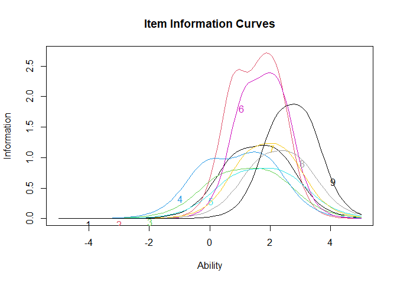

``` r
plot(grm1, type = "ICC", items = 2, zrange = c(-5, 5), 
     main = "Item Characteristic Curves - Item: q2")
```

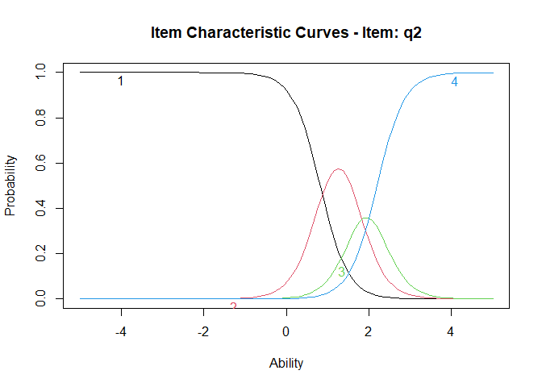

``` r
plot(grm1, type = "ICC", items = 5, zrange = c(-5, 5),
     main = "Item Characteristic Curves - Item: q5")
```

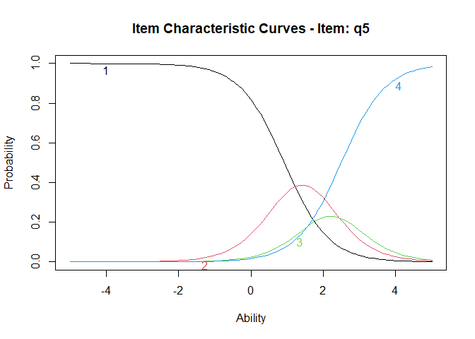

The discrimination parameter acts as the slope of the curves, so the
response categories of item 2 (with a very high discrimination) all have
a very steep slope. The response categories of item 5 (a low
discrimination) have a very shallow slope.

For each item: As ability (level of depression) increases, the
probability of selecting response category 1, “Not at all”, decreases.
And for response category 4, “nearly everyday”, it’s vice versa. This is
expected, as someone without depression would easily select “not at all”
for many of the questions, it’s only if they have some level of
depression they would start endorsing a higher category.

## 2PL and GRM Test Information Function

The Test Information Function best shows what information was lost when
I dichotomized the data for the 2PL

``` r
pl2_TIF <- plot(pl2, type = c("IIC"), 
                items = c(0), 
                col = "red", 
                ylim=c(0,15),
                xlab = "Depression")
grm_TIF <- plot(grm1, type = "IIC", items = 0, plot = FALSE)
lines(grm_TIF, col = "blue")


legend("topleft", legend = c("GRM", "2PL"), col = c("blue", "red"), lty = 1)
```

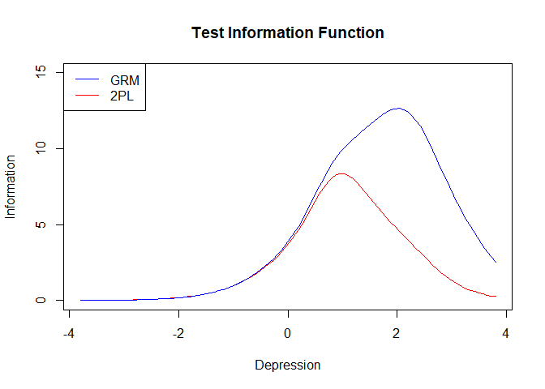

Up until a low-moderate depression level, both the dichotomous and
polytomous IRT yielded the same information. GRM gives more information
about the more severely depressed people, which you lose if you just
ask, “Do you have any symptoms?” (essentially what the dichotomized data
was).

## Rating Scale Model

``` r
rsm1 <-TAM::tam.mml(ds,irtmodel ="RSM", verbose = FALSE)

kable(rsm1$item[1:7])
```

|     | item |    N |         M | xsi.item | AXsi\_.Cat1 | AXsi\_.Cat2 | AXsi\_.Cat3 |
|:----|:-----|-----:|----------:|---------:|------------:|------------:|------------:|
| q1  | q1   | 5151 | 0.4036109 | 2.053358 |   1.6075537 |    4.093673 |    6.160075 |
| q2  | q2   | 5161 | 0.3427630 | 2.251587 |   1.8057827 |    4.490131 |    6.754763 |
| q3  | q3   | 5161 | 0.6126720 | 1.516058 |   1.0702532 |    3.019072 |    4.548174 |
| q4  | q4   | 5161 | 0.7824065 | 1.170635 |   0.7248302 |    2.328226 |    3.511905 |
| q5  | q5   | 5158 | 0.4007367 | 2.061523 |   1.6157183 |    4.110002 |    6.184569 |
| q6  | q6   | 5159 | 0.2440395 | 2.645112 |   2.1993074 |    5.277180 |    7.935336 |
| q7  | q7   | 5159 | 0.2554759 | 2.593513 |   2.1477077 |    5.173981 |    7.780538 |
| q8  | q8   | 5158 | 0.1632416 | 3.091736 |   2.6459310 |    6.170427 |    9.275207 |
| q9  | q9   | 5157 | 0.0562342 | 4.211065 |   3.7652601 |    8.409085 |   12.633195 |

The difficulties, from the “AXsi\_.Cat1, AXsi\_.Cat2, and AXsi\_.Cat3”
columns, while seemingly scaled differently, show the expected values.
Q9 has the highest difficulty, and Q4 has the lowest. There are no
discrimination parameters, which lowers the complexity of the model
quite a bit. Next, I will graph the Item Characteristic Curves to better
see what this constrained discriminatory parameter looks like.

## RSM: Item Characteristic Curves

``` r
plot(rsm1,
     type = "items",
     export = FALSE,
     package = "graphics",
     observed = FALSE,
     low = -6,
     high = 6,
     items = c(2, 5))
```

    Iteration in WLE/MLE estimation  1   | Maximal change  2.9707 
    Iteration in WLE/MLE estimation  2   | Maximal change  2.8242 
    Iteration in WLE/MLE estimation  3   | Maximal change  1.577 
    Iteration in WLE/MLE estimation  4   | Maximal change  0.4525 
    Iteration in WLE/MLE estimation  5   | Maximal change  0.1469 
    Iteration in WLE/MLE estimation  6   | Maximal change  0.0165 
    Iteration in WLE/MLE estimation  7   | Maximal change  6e-04 
    Iteration in WLE/MLE estimation  8   | Maximal change  0 
    ----
     WLE Reliability= 0.412 

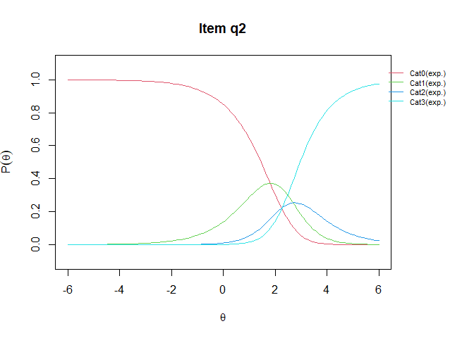

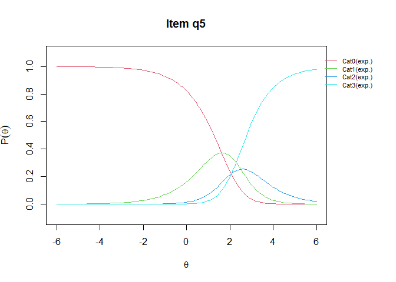

Interesting! The RSM would have us believe that Q2 and Q5 are extremely
similar, even while they differ wildly in how discriminating they are.
Next, I plot it’s test information curve with the 2PL and GRM models.

## RSM: Test Information Curve

``` r
rsm1_TIF <- plot(IRT.informationCurves(rsm1), 
                col = "green", 
                xlim = c(-4, 6),
                ylim = c(0,15),
                ylab = "Information",
                xlab = "Depression")
pl2_TIF <- plot(pl2,  type = "IIC", items = 0, zrange = c(-4, 6), plot = FALSE)
grm_TIF <- plot(grm1, type = "IIC", items = 0, zrange = c(-4, 6), plot = FALSE)


lines(grm_TIF, col = "blue")
lines(pl2_TIF, col = "red")

legend("topleft", 
       legend = c("GRM", "2PL", "RSM"), 
       col = c("blue", "red", "green"), 
       lty = 1)
```

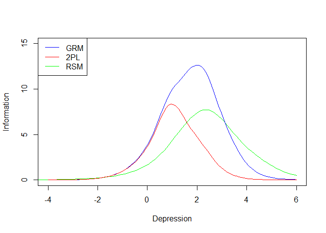

This may not be accurate, as I don’t know how the TAM package creates
the Test Information Curve. With that, it’s noteworthy how much more
information the GRM gives compared to the RSM. Again, this may be
different if the discrimination parameters of the questions weren’t so
different.

## Log-Likelihood and AIC of GRM and RSM

Because GRM is the more complex model, I expect it to have a larger
Log-likelihood. However, it should be a better fit due to the added
discrimination abilities giving the model more information (as I’ve
shown with the Test Information Function), which a lower AIC would
signify.

``` r
comparison <- IRT.compareModels(grm1, rsm1)
```

    Warning in rbind(dfr, dfr1): number of columns of result is not a multiple of
    vector length (arg 1)

``` r
summary(comparison, extended = FALSE)
```

    Absolute and relative model fit

      Model   loglike Deviance Npars Nobs      AIC      BIC     AIC3       GHP
    1  grm1 -27895.93 55791.85    36 5735 55863.85 56103.41 55899.85 -27895.93
    2  rsm1 -28752.26 57504.52    12 5164 57528.52 57607.11 57540.52      0.62

    Likelihood ratio tests - model comparison 

      Model1 Model2     Chi2 df p
    1   rsm1   grm1 1712.665 24 0

Comparing the AIC’s of each model, the Graded Response Model is the
better fit. If the discriminatory parameters of the GRM were all very
similar, then the RSM may have been a better fit due to the lower
complexity.

## Confirmatory Factor Analysis with Polytomous Data

Here, I fit a CFA with the original, polytomous data. This should be
very close to the GRM, now that it is using the same data.

``` r
mod2 <-
  "depression =~ q1 + q2 + q3 + q4 + q5 +
                 q6 + q7 + q8 + q9
"


cfafit2 <- cfa(mod2, data = ds,
              ordered = c("q1", "q2", "q3", "q4", "q5",
                          "q6", "q7", "q8", "q9"),
              estimator = "WLSMV",
              check.gradient = TRUE
              )

summary(cfafit2, fit.measures = TRUE, standardized = TRUE)
```

    lavaan 0.6.15 ended normally after 17 iterations

      Estimator                                       DWLS
      Optimization method                           NLMINB
      Number of model parameters                        36

                                                      Used       Total
      Number of observations                          5134        5735

    Model Test User Model:
                                                  Standard      Scaled
      Test Statistic                               325.090     583.771
      Degrees of freedom                                27          27
      P-value (Chi-square)                           0.000       0.000
      Scaling correction factor                                  0.559
      Shift parameter                                            2.037
        simple second-order correction                                

    Model Test Baseline Model:

      Test statistic                             41255.954   23189.999
      Degrees of freedom                                36          36
      P-value                                        0.000       0.000
      Scaling correction factor                                  1.780

    User Model versus Baseline Model:

      Comparative Fit Index (CFI)                    0.993       0.976
      Tucker-Lewis Index (TLI)                       0.990       0.968
                                                                      
      Robust Comparative Fit Index (CFI)                         0.925
      Robust Tucker-Lewis Index (TLI)                            0.900

    Root Mean Square Error of Approximation:

      RMSEA                                          0.046       0.063
      90 Percent confidence interval - lower         0.042       0.059
      90 Percent confidence interval - upper         0.051       0.068
      P-value H_0: RMSEA <= 0.050                    0.902       0.000
      P-value H_0: RMSEA >= 0.080                    0.000       0.000
                                                                      
      Robust RMSEA                                               0.124
      90 Percent confidence interval - lower                     0.113
      90 Percent confidence interval - upper                     0.136
      P-value H_0: Robust RMSEA <= 0.050                         0.000
      P-value H_0: Robust RMSEA >= 0.080                         1.000

    Standardized Root Mean Square Residual:

      SRMR                                           0.045       0.045

    Parameter Estimates:

      Standard errors                           Robust.sem
      Information                                 Expected
      Information saturated (h1) model        Unstructured

    Latent Variables:
                       Estimate  Std.Err  z-value  P(>|z|)   Std.lv  Std.all
      depression =~                                                         
        q1                1.000                               0.738    0.738
        q2                1.174    0.020   59.412    0.000    0.866    0.866
        q3                0.940    0.020   45.940    0.000    0.693    0.693
        q4                1.002    0.018   55.103    0.000    0.739    0.739
        q5                0.912    0.021   44.119    0.000    0.673    0.673
        q6                1.148    0.020   57.410    0.000    0.847    0.847
        q7                1.009    0.022   46.399    0.000    0.744    0.744
        q8                0.966    0.026   37.308    0.000    0.712    0.712
        q9                1.091    0.030   36.901    0.000    0.804    0.804

    Intercepts:
                       Estimate  Std.Err  z-value  P(>|z|)   Std.lv  Std.all
       .q1                0.000                               0.000    0.000
       .q2                0.000                               0.000    0.000
       .q3                0.000                               0.000    0.000
       .q4                0.000                               0.000    0.000
       .q5                0.000                               0.000    0.000
       .q6                0.000                               0.000    0.000
       .q7                0.000                               0.000    0.000
       .q8                0.000                               0.000    0.000
       .q9                0.000                               0.000    0.000
        depression        0.000                               0.000    0.000

    Thresholds:
                       Estimate  Std.Err  z-value  P(>|z|)   Std.lv  Std.all
        q1|t1             0.643    0.019   34.054    0.000    0.643    0.643
        q1|t2             1.313    0.024   54.152    0.000    1.313    1.313
        q1|t3             1.691    0.030   55.561    0.000    1.691    1.691
        q2|t1             0.709    0.019   36.944    0.000    0.709    0.709
        q2|t2             1.471    0.026   55.614    0.000    1.471    1.471
        q2|t3             1.875    0.035   53.823    0.000    1.875    1.875
        q3|t1             0.303    0.018   17.027    0.000    0.303    0.303
        q3|t2             1.040    0.021   48.581    0.000    1.040    1.040
        q3|t3             1.399    0.025   55.116    0.000    1.399    1.399
        q4|t1            -0.056    0.018   -3.182    0.001   -0.056   -0.056
        q4|t2             0.939    0.021   45.584    0.000    0.939    0.939
        q4|t3             1.378    0.025   54.911    0.000    1.378    1.378
        q5|t1             0.640    0.019   33.946    0.000    0.640    0.640
        q5|t2             1.327    0.024   54.333    0.000    1.327    1.327
        q5|t3             1.689    0.030   55.572    0.000    1.689    1.689
        q6|t1             0.986    0.021   47.035    0.000    0.986    0.986
        q6|t2             1.604    0.029   55.863    0.000    1.604    1.604
        q6|t3             1.945    0.037   52.812    0.000    1.945    1.945
        q7|t1             0.989    0.021   47.130    0.000    0.989    0.989
        q7|t2             1.553    0.028   55.872    0.000    1.553    1.553
        q7|t3             1.853    0.034   54.107    0.000    1.853    1.853
        q8|t1             1.257    0.024   53.327    0.000    1.257    1.257
        q8|t2             1.789    0.033   54.815    0.000    1.789    1.789
        q8|t3             2.103    0.042   49.893    0.000    2.103    2.103
        q9|t1             1.782    0.032   54.885    0.000    1.782    1.782
        q9|t2             2.231    0.047   47.032    0.000    2.231    2.231
        q9|t3             2.521    0.064   39.365    0.000    2.521    2.521

    Variances:
                       Estimate  Std.Err  z-value  P(>|z|)   Std.lv  Std.all
       .q1                0.456                               0.456    0.456
       .q2                0.251                               0.251    0.251
       .q3                0.519                               0.519    0.519
       .q4                0.454                               0.454    0.454
       .q5                0.547                               0.547    0.547
       .q6                0.283                               0.283    0.283
       .q7                0.446                               0.446    0.446
       .q8                0.493                               0.493    0.493
       .q9                0.353                               0.353    0.353
        depression        0.544    0.017   31.727    0.000    1.000    1.000

    Scales y*:
                       Estimate  Std.Err  z-value  P(>|z|)   Std.lv  Std.all
        q1                1.000                               1.000    1.000
        q2                1.000                               1.000    1.000
        q3                1.000                               1.000    1.000
        q4                1.000                               1.000    1.000
        q5                1.000                               1.000    1.000
        q6                1.000                               1.000    1.000
        q7                1.000                               1.000    1.000
        q8                1.000                               1.000    1.000
        q9                1.000                               1.000    1.000

## Compare Discrimination Parameter of GRM and Factor Loadings of Polytomous CFA

``` r
model_loadings_poly <- inspect(cfafit2, what = "std")[["lambda"]]

discrims_poly <- list()
for (i in 1:9) {
  discrims_poly[[paste0("q", i)]] <- summary(grm1)$coefficients[[paste0("q", i)]][4]
}

discrims_poly <- unlist(discrims_poly)
names(discrims_poly) <- names(discrims_poly)

D <- 1.7

df_loadings_poly <- cbind(loadings = model_loadings_poly,
                     discrims_to_loadings = (discrims_poly / D) 
                     / 
                     (sqrt(1 + ((discrims_poly / D)^2))))

df_loadings_poly <- df_loadings_poly %>% 
  as.data.frame() %>% 
  dplyr::rename(cfa_loadings = depression)


df_loadings_poly %>% 
  as.data.frame() %>% 
  dplyr::mutate(dif = cfa_loadings-discrims_to_loadings, 
                rat = cfa_loadings/discrims_to_loadings)
```

       cfa_loadings discrims_to_loadings          dif       rat
    q1    0.7375195            0.7584342 -0.020914731 0.9724238
    q2    0.8655098            0.8707365 -0.005226748 0.9939973
    q3    0.6932849            0.6944226 -0.001137694 0.9983617
    q4    0.7391335            0.7461941 -0.007060588 0.9905379
    q5    0.6728642            0.6935380 -0.020673861 0.9701907
    q6    0.8466470            0.8549768 -0.008329818 0.9902573
    q7    0.7441284            0.7615307 -0.017402315 0.9771482
    q8    0.7121545            0.7444280 -0.032273496 0.9566466
    q9    0.8042705            0.8224679 -0.018197394 0.9778746

Almost equivalent. The values are close enough to have shown that for
unidimensional polytomous data, CFA and the GRM are theoretically
equivalent.  

## Conclusion

The IRT analysis showed that the questions were all positive, that the
discrimination parameters were all good, that the IIC suggests that the
scale is overall reliable, but the reliability peaks on low-moderate
depression. But in a screening tool, this is probably what we want.

The factor analysis gave extremely similar results to the IRT analysis,
theoretically identical. However, the model fit was not perfect,
suggesting that it was not uni-dimensional, which might be a problem.
The modification indices suggested some additional covariances, but I
didn’t as it would be no longer equivalent to the IRT.

Also, the fact that I can add covariances to the CFA leads me to believe
that CFA is the more flexible model. The IRT models did however yield
more interpretable results, and in that way seem specialized for
uni-dimensional testing. CFA has a much wider application of uses (i.e.,
multivariate systems) and seems to focus on the relationship between
variables.

I wanted to try running a CFA using Maximum Likelihood, however the
model would not converge when the estimator was “MML”. This would have
allowed me to use the AIC() function to compare my CFA models to the IRT
models. Instead, I compared the factor loadings and discrimination
parameters. This showed that the CFA is largely equivalent to an IRT
model when using the same data.

Comparing the RSM and the GRM, the GRM was a better fit. This was due to
the fact that the questions all had different discriminatory parameters,
something that the RSM does not calculate (and for that reason, took
much less time to run).

## References

<div id="refs" class="references csl-bib-body hanging-indent">

<div id="ref-cho2023" class="csl-entry">

Cho, Eunseong. 2023. “Interchangeability Between Factor Analysis,
Logistic IRT, and Normal Ogive IRT.” *Frontiers in Psychology* 14
(September). <https://doi.org/10.3389/fpsyg.2023.1267219>.

</div>

<div id="ref-forero2009" class="csl-entry">

Forero, Carlos G., and Alberto Maydeu-Olivares. 2009. “Estimation of IRT
Graded Response Models: Limited Versus Full Information Methods.”
*Psychological Methods* 14 (3): 275–99.
<https://doi.org/10.1037/a0015825>.

</div>

<div id="ref-rizopoulos2006" class="csl-entry">

Rizopoulos, Dimitris. 2006. “Ltm: An R Package for Latent Variable
Modeling and Item Response Theory Analyses.” *Journal of Statistical
Software* 17 (5). <https://doi.org/10.18637/jss.v017.i05>.

</div>

</div>
